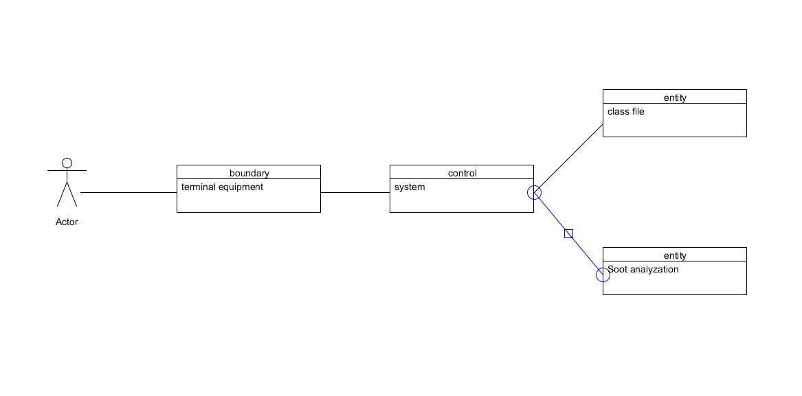
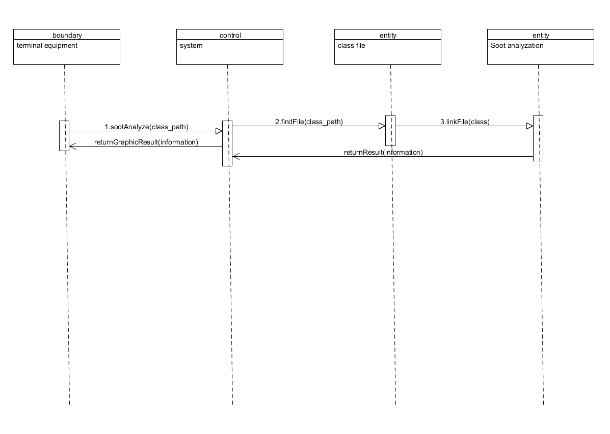

## 软件设计文档

### 项目背景
该文档介绍的产品是一种java静态测试工具--基于Soot平台的定值到达测试工具，该工具面向软件开发人员以及软件测试人员。

---
### 相关理论及原理

#### 理论概述
“定值到达”是最常见和有用的数据流模式之一。编译器能够根据到达定值信息知道x在点p上的值是否为常量，而如果x在点p上被使用，则编译器可以指出x是否未经定值就被使用。

而我们在《编译原理》里面所学的：如果存在一条从紧随在定值d后面的程序点到达某一个程序点p的路径，并且在这条路径上d没有被“杀死”，我们就说定值d到达程序点p。如果在这条路径上有对变量x的其他定值，我们就说变量x的这个定值(定值d)被“杀死”了。

#### 公式原理
**相关前导定义：**
1. IN[B]:基本块B的入口点的活跃变量集合
2. OUT[B]:基本块B的出口点的活跃变量集合
3. def[B]:在基本块B内定义，但是定义前在B中没有被引用的变量的集合
4. gen[n]:一种传递函数，表示节点n产生的定值(假设一个语句节点至多产生一个定值)
5. kill[n]:一种传递函数，表示节点n“杀死”的定值(gen[n]产生一个定值之后就会将该变量的其余全部定值“杀死”)

**到达定值的传递方程以及控制流方程**

到达定值对于单个语句的传递方程如下图所示，一个基本块内的依据就是按照这组方程建立起联系的。和单个语句一样，一个基本块也会产生一个定值集合，并杀死一个定值集合：


之后再根据基本块之间的控制流得到的约束集合，我们可以生成一个控制流方程。其实控制流方程的含义就是在路径交叉点进行数据流值得交汇，在到达定值中，交汇运算就是并集运算(U)。


对于定值到达来说，只要一个定值能够沿着至少一条路径到达某个程序点，就说这个定值到达该程序点。所以控制流方程的交汇运算时并集，但是对于其他一些数据流问题交汇运算时交集，例如可用表达式。

**到达定值的迭代分析算法**

假设每个控制流图都有两个空的基本块，代表了控制流图的ENTRY节点和EXIT节点。由于没有定值到达这个图的开始，所以基本块ENTRY的传递函数是一个简单的返回空集Ø的常函数，即OUT[ENTRY] = Ø.

到达定值问题使用下面方程的定义： 
OUT[ENTRY] = Ø
且对于所有的不等于ENTRY的基本块B，有

OUT[B] = gen(B) U (IN[B] - kill(B)) 
IN[B] = U OUT[P] ,其中P是B的一个前驱基本块

我们可以使用下面的算法来求这个方程组的解。这个算法来自《编译原理》中到达定值部分。
所以我们可以根据该理论设计实际算法如下：
到达定值算法： 
输入：一个流图，其中每个基本块 B 的 kill(B) 集和 gen(B) 集都已经计算出来了。 
输出：到达流图中各个基本块 B 的入口点和出口点的定值的集合，即 IN[B] 和 OUT[B] 。 
方法：我们使用迭代的方法来求解。一开始，我们“估计”对于所有基本块 B 都有 OUT[B] = Ø，并逐步逼近想要的 IN 和 OUT 值。因为我们必须不停地迭代直到各个 IN 值（因此各个 OUT 值也）收敛，所以我们使用一个 bool 变量 change 来记录每次扫描各基本块时是否有 OUT 值发生改变。

```
OUT[ENTRY] = Ø;
for (all block B except ENTRY) OUT[B] = Ø;
while (some OUT changes) {
    for (all block B except ENTRY) {
        IN[B] = U(P is one of the precursors of B) OUT[P]; //apply control_flow equation
        OUT[B] = gen[B] U (IN[B] - kill[B]); //apply data_flow equation
    }
}
```

从算法中我们可以明确看到，数据流值是从前驱 P 到 IN[B] 然后再流向 OUT[B] 这样一个从前向后不断传播的。然后从Ø 不断扩大直到越过精确解到达“保守解”。

---
### 用到的技术
- Soot
- Graphic User Interface

---
### BCE




---
### 技术选型理由

#### JAVA图形化界面
**使用图形化界面的原因**
1. 使用的Soot平台搭建在JAVA平台上拥有较好的兼容性
2. 以前的实训拥有过开发JAVA图形化界面的经验
3. 方便与用户进行交互，给予用户更好的理解我们所分析的程序

#### Soot
**Soot的技术支持：**
1. 对于bytecode的完整抽象，包括baf,jimple,simple三个层次的内部表示，各个层次之间可相互转化。baf对bytecode进行了词法抽象，它封装了java栈机。jimple是3-address code方式的，相对baf它结构更清晰，每条指令都有显式的操作数，更适用于程序分析和代码优化。simple格式是jimple格式进行SSA转化后的结果，该格式为数据流分析提供了方便。
2. 支持.java文件和.class文件的手工构造。用户可以按照java规范，构造.java或.class程序的内部表示，soot支持将内部表示映射回源程序或字节码。
3. 完整的控制流图、方法调用图构建支持。soot提供了过程内和过程间的分析与优化支持，用户可以很方便的获得每个方法的控制流图和各个tradeoff级别上的全局调用图。
4. 程序流分析框架，前向、后向的数据流迭代模板。Soot的FlowAnalysis类簇可以让用户很方便的定义自己的数据流分析。对于一种新的数据流分析，用户只要给出dataflow fact上的格，每个语句上的流函数和会合点的合并方法即可。
5. 对象类型分析、指针分析支持。Soot提供了多种对象类型分析方法，且本身提供一个Subset-based的指针分析模块。
6. 代码优化支持。使用Soot可以很方便的进行死代码消除、虚函数静态化等常见优化。

**Soot的优点**
1. 良好的技术支持，有回复及时的mail-list
2. 高质量的代码(6M的.java源代码)
3. 清晰的内部表示
4. 很好的扩展性
5. 解决了很多图形化界面的问题

**Soot的缺点**
1. 只支持hook方式的扩展
2. 效率不高，对一个小程序进行全局分析就可能消耗数百兆内存
